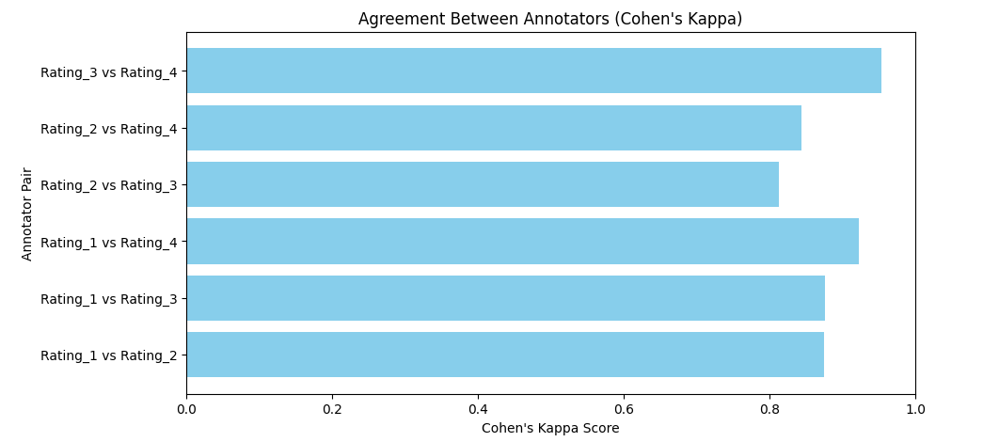
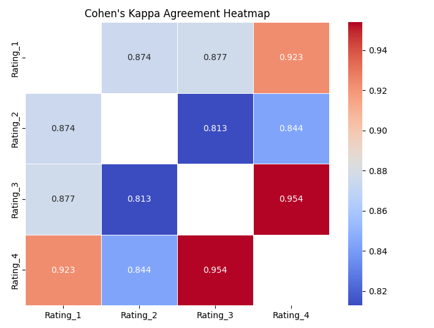
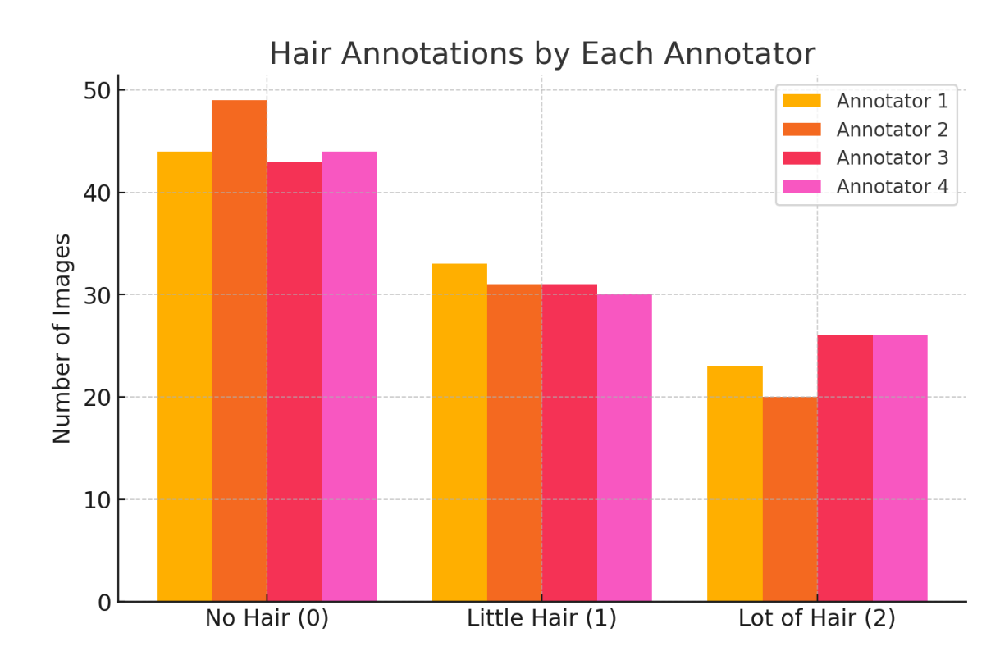

# Project Report on skin lesions: Group B

## Why do we need to work on this topic and investigate skin lesions?

Skin lesions are a common health issue that affects millions of people worldwide.  
Skin lesions are areas of your skin that are different from the skin around them.  
Skin lesions detection can help to solve the problem with skin cancer diagnosis.  

In the **"Skin Lesion Extraction And Its Application"** Master thesis of Yanliang Gu at "Michigan Technological University" this problem was explored.  

Yanliang Gu focuses on developing a skin lesion detection algorithm to aid in skin cancer diagnosis.  
The proposed algorithm utilizes color information and thresholding techniques, with an emphasis on evaluating various color spaces to determine optimal performance.  
Experimental results indicate that the YUV color space yields the best detection outcomes.  
Additionally, Gu introduces a distance histogram-based threshold selection method, which outperforms other adaptive thresholding techniques in color detection tasks.  
The thesis also explores GPU acceleration methods to enhance the speed of skin lesion extraction processes, demonstrating the potential for significant performance improvements. To improve the efficiency of skin lesion extraction, the thesis explores GPU acceleration methods, demonstrating significant performance improvements in real-time processing. Building upon these findings, Gu developed a mobile application that integrates the optimized detection algorithm, making automated skin cancer diagnosis more accessible to both medical professionals and the general public.

Building upon these findings, Gu developed a mobile application for skin cancer diagnosis. 

As part of our research on skin lesions, we will:

- **Analyze a dataset** of skin lesion images, ensuring a diverse range of samples for robust evaluation.
- **Assess the presence of hair** in the images, which can obstruct lesion detection and lead to false positives or segmentation errors.
- **Make detailed annotations** to label lesion boundaries, hair obstructions, and other relevant skin features.
- **Implement hair segmentation techniques** to remove hair artifacts from the images, improving lesion visibility and accuracy in automated detection.
- **Draw appropriate conclusions** regarding the effectiveness of different segmentation techniques and explore potential refinements to the algorithm.

## Data observation

Here we will summarize what we can observe. Amount of pictures annotated by everyone

### Cohen's Kappa method to compare how often annotators agree
Cohen’s Kappa is a statistical measure used to assess the agreement between two annotators while accounting for the possibility of random agreement. Unlike simple percentage agreement, Cohen’s Kappa corrects for agreement that could occur by chance, providing a more accurate reflection of consistency between annotators. The values of Cohen’s Kappa range from -1 to 1, where 1 represents perfect agreement, 0 indicates agreement no better than chance, and negative values suggest systematic disagreement.

We've annotated pictures by marking it from 0 to 2. 0 means there is no hair, 1 - a little bit, 2 - a lof of hair. 

 
### How can we interpret this agreement measure?
The heatmap presents Cohen's Kappa scores for different pairs of annotators (Rating_1, Rating_2, Rating_3, and Rating_4). Cohen's Kappa measures inter-rater agreement, correcting for chance agreement.
The highest agreement is between Rating_3 and Rating_4 (0.954).
Rating_1 generally has high agreement with other annotators (above 0.87).
Rating_2 seems to have slightly lower agreement scores compared to the others.
Rating_4 has the strongest agreement overall, especially with Rating_3 (0.954) and Rating_1 (0.923).

The asymmetry in agreement values (e.g., Rating_1 vs. Rating_3 is 0.877, while Rating_3 vs. Rating_1 is slightly different) may indicate differences in individual rating tendencies.

 

The dataset analysis (result.csv) shows that for images with no hair (annotation 0), Annotator 1 marked 44 images, Annotator 2 marked 49, Annotator 3 marked 43, and Annotator 4 marked 44. For images with a little bit of hair (annotation 1), Annotator 1 assigned this rating to 33 images, Annotator 2 to 31, Annotator 3 to 31, and Annotator 4 to 30. In cases where there was a lot of hair (annotation 2), Annotator 1 recorded 23 images, Annotator 2 recorded 20, Annotator 3 recorded 26, and Annotator 4 recorded 26. 

 

The dataset analysis shows that 43 images were annotated with 0 (no hair) by all four annotators, 25 images were annotated with 1 (a little bit of hair) by all annotators, and 19 images were annotated with 2 (a lot of hair) by all annotators. This indicates a higher level of agreement among annotators when identifying images without hair compared to those with some or a lot of hair.

## TELEA method to remove the hair from picture
Explain the TELEA method itself -> then some algorithm - delete this line(comment after)

The TELEA (Fast Marching Method-based Inpainting) algorithm is a good choice for hair removal/segmentation in skin lesion analysis for several reasons.
The algorithm fills in the missing pixels by propagating information from the surrounding known pixels in a smooth manner. This is particularly effective in cases where hair partially covers the lesion, as it avoids introducing sharp discontinuities.
Since hair strands are usually thin, removing them while preserving the underlying lesion structure is crucial. TELEA efficiently interpolates the missing values without distorting important lesion characteristics.

Many segmentation tasks rely on accurate lesion boundaries. TELEA ensures that hair occlusions do not lead to false lesion contours, which is important for automated diagnosis and feature extraction.

## Visual results
Here we will insert before, after (4 pictures)
Please, upload examples of good hair removal and great. Discuss in this part why this is a good example of hair segmentation, why this one is bad. 

## Conclusion
Conclusion sentences: skin lesions field - why it is a growing field, how can we tackle this, different methods, what we used?

